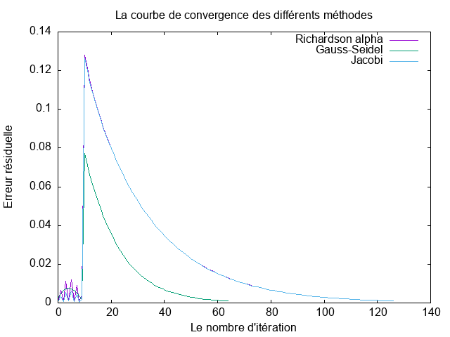

# Rapport sur la résolution de l'équation de la chaleur en 1D stationnaire.

**Matière:** Calcul Numérique  
**Auteur:** Yingqin SU  
**Date:** 8 Janvier 2024

## Introduction

L'équation de chaleur est une équation aux dérivées partielles qui modélise la propagation de la chaleur dans un matériau au fil du temps. Elle joue un rôle crucial dans divers domaines tels que la physique, l'ingénierie, la météorologie et la biologie. Cette équation permet de décrire comment la distribution de la température évolue dans un système donné, en fonction des conditions initiales et des propriétés thermiques du matériau.

Afin d'explorer plus en détail le comportement de l'équation de chaleur, nous allons mettre en œuvre la résolution numérique de l'équation de chaleur unidimensionnelle en utilisant le langage de programmation C. Nous aborderons deux approches distinctes : la méthode directe basée sur la décomposition LU (Lower-Upper) et des méthodes itératives telles que la méthode de Richardson avec un paramètre alpha variable, la méthode de Jacobi ainsi que la méthode de Gauss-Seidel.

Ces approches offrent des perspectives différentes pour résoudre l'équation de chaleur, permettant ainsi une comparaison des performances et une compréhension approfondie de la résolution numérique. À travers cette implémentation, nous explorerons les avantages et les limitations de chaque méthode, contribuant ainsi à une meilleure appréhension de la modélisation thermique dans des contextes variés.

## Equation de la chaleur 1D

L'équation de la chaleur en une dimension, dans le domaine $0 < x < 1$, avec les conditions aux bords $T(0) = T_0$ et $T(1) = T_1$, est formulée comme suit:

$$-k \frac{\partial^2 T}{\partial x^2} = g, \quad \text{pour } x \in ]0,1[$$

où $g$ est le terme source, $k > 0$ est le coefficient de conductivité thermique, $T(x)$ représente la température en fonction de la position $x$, et $T_0$ et $T_1$ sont les températures aux bords du domaine ($T_0 < T_1$).

En notation matricielle, le système discret associé est défini comme:

$$Au = f, \quad A \in \mathbb{R}^{n \times n}, \quad u, f \in \mathbb{R}^n$$

La matrice $A$ est construite à partir des coefficients de différenciation centrée d'ordre 2. Le vecteur $f$ représente les valeurs de température aux nœuds, tandis que le vecteur $u$ contient les termes de source.

La solution analytique de ce problème de la chaleur est donnée par $T(x) = T_0 + x(T_1 - T_0)$.

## Travail préliminaire : Établissement d’un cas de test

En utilisant le développement de Taylor, les expressions suivantes peuvent être déduites :

$$T(x+h) = T(x) + h \frac{dT}{dx} + \frac{h^2}{2} \frac{d^2T}{dx^2}+o(h^2) \quad (1)$$  
$$T(x-h) = T(x) - h \frac{dT}{dx} + \frac{h^2}{2} \frac{d^2T}{dx^2}+o(h^2) \quad (2)$$

En combinant les équations $(1)$ et $(2)$, on obtient :

$$T(x+h) + T(x-h) \approx 2T(x) + h^2 \frac{d^2T}{dx^2}$$

Ainsi, on dérive le résultat suivant :

$$\frac{d^2T}{dx^2} \approx \frac{T(x+h) + T(x-h) - 2T(x)}{h^2} \approx \frac{1}{h^2}[[T(x+h) - T(x)] - [T(x)-T(x-h)]]\approx \frac{1}{h^2}\Delta^2 T(x, h)$$

Considérons maintenant $T(x_i)$ comme la température au point $x_i$ et $g_i$ comme le terme source associé au point $x_i$, où $h$ représente le pas de discrétisation. Ceci se formule comme suit :

---
$$
\forall i \in [0, n], \quad T(x_{i+1}) = T(x_i + h)
$$

---
$$\forall i \in [1, n+1], \quad T(x_{i-1}) = T(x_i - h)
$$
---

Pour $i \in [1, n]$, nous avons ainsi:

$$
-k\frac{d^2T}{d(x_i)^2} = g_i
$$

$$
g_i = -\frac{k}{h^2}[T(x_{i+1}) -2 T(x_i) + T(x_{i-1})]
$$

Ainsi, nous arrivons au système linéaire que nous devons résoudre, c'est-à-dire $Au=f$, avec :

la matrice $A$:

$A = -\frac{k}{h^2} \begin{bmatrix}
-2 & 1 & 0 & \cdots & 0 \\
1 & -2 & 1 & \cdots & 0 \\
0 & 1 & -2 & \ddots & 0 \\
\vdots & \vdots & \ddots & \ddots & 1 \\
0 & 0 & \cdots & 1 & -2
\end{bmatrix}$

le vecteur $x$:

$u = \begin{bmatrix} T(x_1) \\ T(x_2) \\ T(x_3)\\\vdots \\T(x_{n-2})\\ T(x_{n-1}) \\ T(x_{n}) \end{bmatrix}$

et le vecteur $f$:

$f = \begin{bmatrix} g_0 + \frac{k}{h^2}T_0 \\ g_2 \\g_3\\ \vdots\\ g_{n-2} \\ g_{n-1} \\ g_n + \frac{k}{h^2}T_1 \end{bmatrix}$

## Méthode directe et stockage bande

En langage C, une matrice de taille `m x n` peut être représentée à l'aide d'un pointeur qui pointe vers l'entête d'une liste de taille `m x n x taille d'éléments`. La constante `lapack_col_major` est utilisée pour indiquer que la matrice est stockée en format colonne majeure, ce qui signifie que les éléments sont stockés côte à côte, avec une structure particulière pour représenter la bande (valeurs non nulles à proximité de la diagonale).

La dimension principale dans le cadre de colonne majeure correspond au nombre de lignes, c'est-à-dire au nombre d'éléments sur une colonne. La fonction `dgbmv` est utilisée pour effectuer une multiplication entre une matrice bande et un vecteur. La fonction `dgbtrf` est employée pour la factorisation LU des matrices bandes, et `dgbtrs` résout un système linéaire `Ax = b` avec `A` sous forme de matrice bande en forme LU compacte.

La fonction `dgbsv` combine les opérations de factorisation de `dgbtrf` et de résolution de système linéaire de `dgbtrs`. Elle factorise `A` et résout le système linéaire `Ax = b`.

La formule de la norme du résidu relatif précédente était $\frac{||y - x||}{||x||}$. Pour calculer, on effectue la mise à jour de `y` en soustrayant `x` de `y` (`y = y - x`), puis on calcule la norme euclidienne de la nouvelle `y`. Ensuite, on calcule la norme euclidienne de `x`, et le résultat final est obtenu en divisant la norme de `y` mise à jour par la norme de `x`. On obtient ainsi la différence relative entre `x` et la mise à jour de `y`.

## Stockage GB et appel à DGBMV

Dans notre programme, nous avons mis en place une fonction intitulée `void set_GB_operator_colMajor_poisson1D(double *AB, int *lab, int *la, int *kv)` pour gérer le stockage de la matrice bande (GB). En utilisant cette fonction ainsi que les fonctions `dgbmv` et `double relative_forward_error(double *x, double *y, int *la)`, nous sommes en mesure de résoudre un système linéaire de la forme \(Ax = b\), pour lequel nous connaissons la solution à l'avance (la solution analytique de la partie 1). Nous calculons ensuite l'erreur relative, et si cette dernière est inférieure à un seuil prédéfini, nous considérons que le test est réussi, ce qui constitue notre critère de validation.

## DGBTRF, DGBTRS, DGBSV

La performance de la fonction dgbtrf est caractérisée par une complexité de $O(n^3)$, indiquant une croissance cubique de la consommation de ressources en fonction de la taille $n$ du problème. Pour dgbtrs, sa performance est évaluée avec une complexité de $O(n^2)$, signifiant une croissance quadratique. La fonction dgbsv, étant une fusion des opérations de dgbtrf et dgbtrs, affiche une complexité de $O(n^3)$, résultant de la combinaison des contributions cubiques de ces deux opérations distinctes.

## Méthode de résolution itérative

Dans le contexte de la méthode itérative, nous avons extrait la diagonale pour Jacobi (où \(M = D\)), la partie D-E pour Gauss-Seidel, et ensuite appliqué la décomposition LU sur \(M\) en utilisant la fonction `dgbtrf`. À chaque itération, nous résolvons le système linéaire \(Mx = b\) en utilisant la fonction `dgbtrs`, où \(M\) est la matrice bande qui stocke la décomposition LU de manière compacte. Ces étapes ont conduit à l'obtention des courbes de convergence respectives pour les trois méthodes. Il est pertinent de noter que les méthodes de Jacobi et Richardson Alpha présentent des comportements de convergence très similaires.

## Contenu du Répertoire

Ce répertoire contient le code correspondant à la solution du problème de Poisson 1D, que ce soit par méthode directe ou itérative. Il est structuré en trois répertoires :

- **src** : Contient les codes sources.
- **include** : Contient les fichiers d'en-tête.
- **bin** : Contient les exécutables.

La compilation et l'exécution peuvent être réalisées en utilisant le fichier Makefile.

**Principales Cibles :**
- `testenv` : bin/tp_testenv
- `tp2poisson1D_direct` : bin/tpPoisson1D_direct
- `tp2poisson1D_iter` : bin/tpPoisson1D_iter

**Commandes :**
- `$ make target` : Compile un exécutable bin/target.
- `$ make all` : Compile les exécutables correspondant à toutes les cibles.
- `$ make run_target` : Exécute ./bin/target.
- `$ make clean` : Supprime les fichiers objets (*.o) et les exécutables dans le répertoire "bin".

**Commandes Spécifiques :**
- `$ make run_testenv`
- `$ make run_tpPoisson1D_iter`
- `$ make run_tpPoisson1D_direct`
